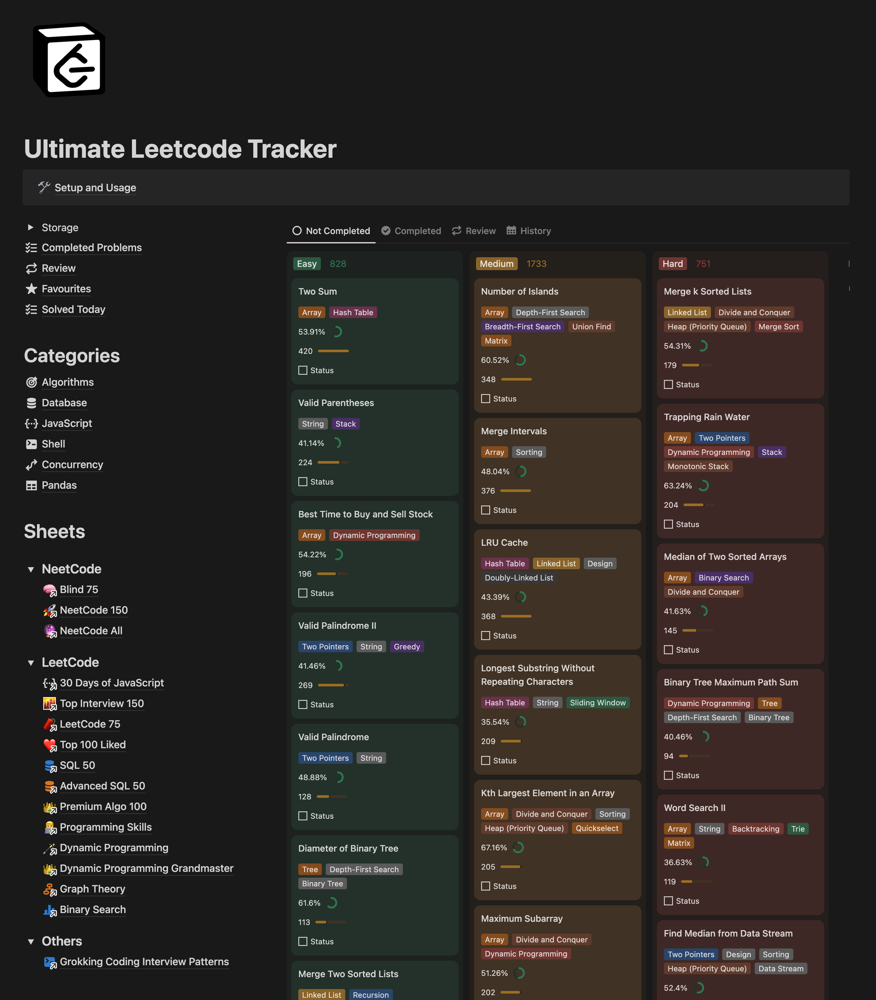
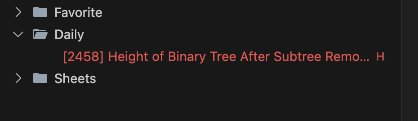
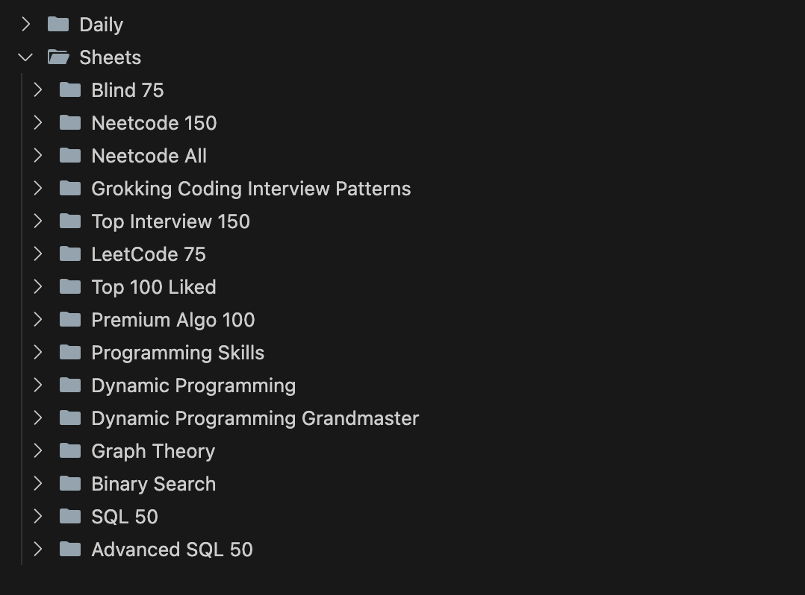
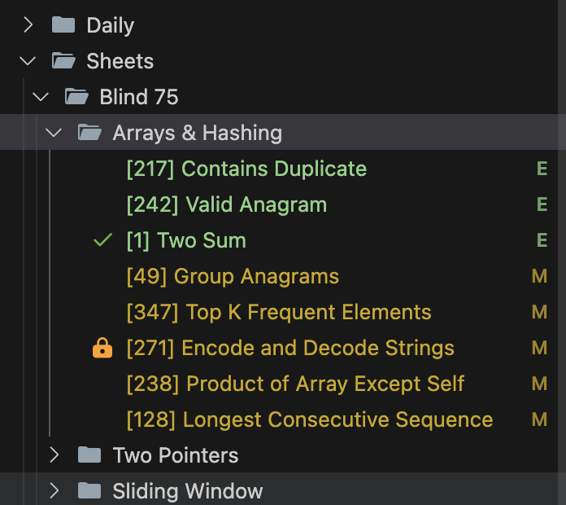
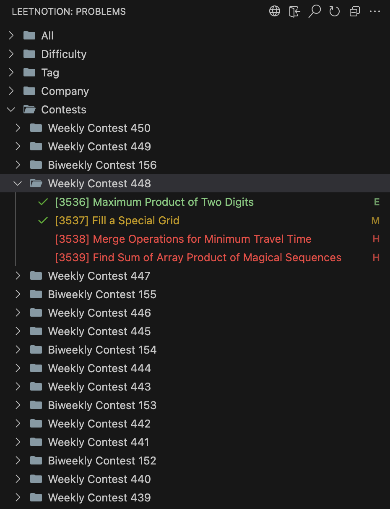
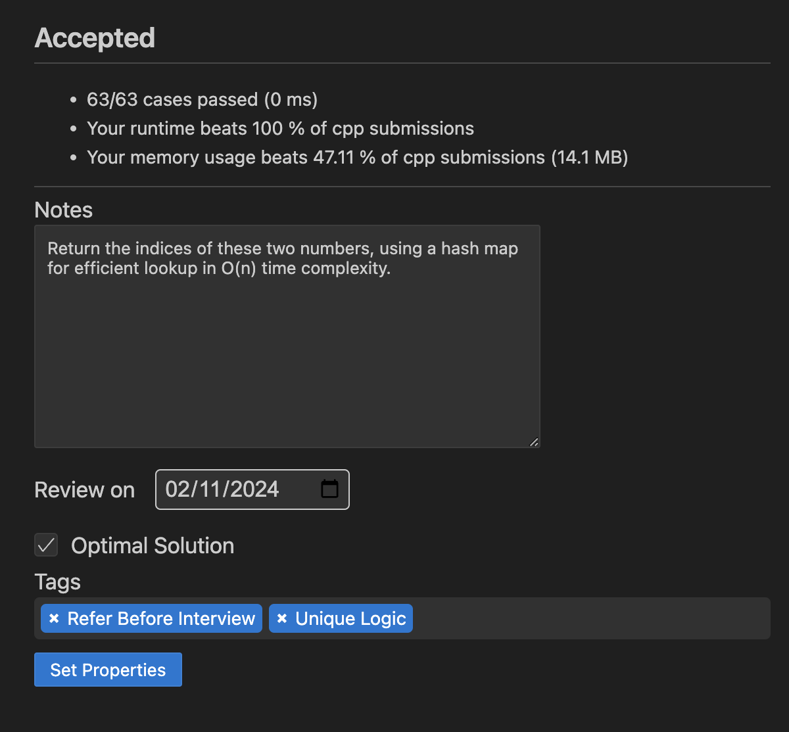

# LeetNotion

> Solve LeetCode problems in VsCode and keep your submissions in sync with your Ultimate LeetCode Tracker template in notion

  

  
  
  

## Requirements

- [VS Code 1.30.1+](https://code.visualstudio.com/)
- [Node.js 10+](https://nodejs.org)
  > NOTE: Please make sure that `Node` is in your `PATH` environment variable. You can also use the setting `leetnotion.nodePath` to specify the location of your `Node.js` executable.

## Quick Start

## Ultimate Leetcode Tracker Notion Template

To get started using this, you can get the Ultimate LeetCode Tracker template from [here](https://codewithsathya.gumroad.com/l/leetnotion). Feel free to duplicate it into your own Notion workspace!

## Features

In addition to all the features of the original [LeetCode extension](https://github.com/LeetCode-OpenSource/vscode-leetcode), LeetNotion offers:

### 🌟 Daily Problem

Displays the LeetCode Problem of the Day directly in the VS Code sidebar, keeping you engaged with daily practice.

---

### 📑 Sheets

Access popular problem sets, such as NeetCode sheets, LeetCode study sheets, and grokking coding interview pattern directly in vscode, for a more targeted learning experience.

---

### 🏆 Contests

View all past contests and their leetcode problems

### 🎯 Auto Check-In

Automatically collects one LeetCode coin every day by checking in, so you won’t miss out on daily rewards.

---

### 🥚 Auto Collect Easter Egg

If available, automatically collects 10 LeetCode coins by collecting the leetcode easter egg.

---

### 🔄 Notion Sync on Submission

When you successfully submit a solution, LeetNotion updates your Notion template with the problem’s status, submission code.

---

### 📥 Existing Submissions Sync

You can import and sync all past submissions to your Notion template, allowing you to track your progress comprehensively.

---

### 📝 Custom Notion Properties

After each submission, it allows you to set additional properties in Notion, such as adding personal notes, marking the solution as optimal, adding custom tags, and setting a review date to revisit the problem later.

---

### 📌 Full Template Update

You can automatically add new problems and update information on all problems in your Notion template with a single command, keeping your tracker organized and up-to-date.

---

Below are the features of original [leetcode vscode extension](https://github.com/LeetCode-OpenSource/vscode-leetcode)

### Sign In/Out

  

- Simply click `Sign in to LeetCode` in the `LeetCode Explorer` will let you **sign in** with your LeetCode account.

- You can also use the following command to sign in/out:
  - **Leetnotion: Sign in**
  - **Leetnotion: Sign out**

---

### Switch Endpoint

  

- By clicking the button  at the **explorer's navigation bar**, you can switch between different endpoints.

- The supported endpoints are:

  - **leetcode.com**
  - **leetcode.cn**

  > Note: The accounts of different endpoints are **not** shared. Please make sure you are using the right endpoint. The extension will use `leetcode.com` by default.

---

### Pick a Problem

  

- Directly click on the problem or right click the problem in the `LeetCode Explorer` and select `Preview Problem` to see the problem description.
- Select `Show Problem` to directly open the file with the problem description.

  > Note：You can specify the path of the workspace folder to store the problem files by updating the setting `leetnotion.workspaceFolder`. The default value is：**$HOME/.leetcode/**.

  > You can specify whether including the problem description in comments or not by updating the setting `leetnotion.showCommentDescription`.

  > You can switch the default language by triggering the command: `LeetCode: Switch Default Language`.

---

### Editor Shortcuts

  

- The extension supports 5 editor shortcuts (aka Code Lens):

  - `Submit`: Submit your answer to LeetCode.
  - `Test`: Test your answer with customized test cases.
  - `Star/Unstar`: Star or unstar the current problem.
  - `Solution`: Show the top voted solution for the current problem.
  - `Description`: Show the problem description page.

  > Note: You can customize the shortcuts using the setting: `leetnotion.editor.shortcuts`. By default, only `Submit` and `Test` shortcuts are enabled.

---

### Search problems by Keywords

  

- By clicking the button  at the **explorer's navigation bar**, you can search the problems by keywords.

---

## Settings

| Setting Name                      | Description                                                                                                                                                                                                                                                   | Default Value      |
| --------------------------------- | ------------------------------------------------------------------------------------------------------------------------------------------------------------------------------------------------------------------------------------------------------------- | ------------------ |
| `leetnotion.hideSolved`             | Specify to hide the solved problems or not                                                                                                                                                                                                                    | `false`            |
| `leetnotion.defaultLanguage`        | Specify the default language used to solve the problem. Supported languages are: `bash`, `c`, `cpp`, `csharp`, `golang`, `java`, `javascript`, `kotlin`, `mysql`, `php`, `python`,`python3`,`ruby`,`rust`, `scala`, `swift`, `typescript`                     | `N/A`              |
| `leetnotion.useWsl`                 | Specify whether to use WSL or not                                                                                                                                                                                                                             | `false`            |
| `leetnotion.endpoint`               | Specify the active endpoint. Supported endpoints are: `leetcode`, `leetcode-cn`                                                                                                                                                                               | `leetcode`         |
| `leetnotion.workspaceFolder`        | Specify the path of the workspace folder to store the problem files.                                                                                                                                                                                          | `""`               |
| `leetnotion.filePath`               | Specify the relative path under the workspace and the file name to save the problem files. More details can be found [here](https://github.com/LeetCode-OpenSource/vscode-leetcode/wiki/Customize-the-Relative-Folder-and-the-File-Name-of-the-Problem-File). |                    |
| `leetnotion.enableStatusBar`        | Specify whether the LeetCode status bar will be shown or not.                                                                                                                                                                                                 | `true`             |
| `leetnotion.editor.shortcuts`       | Specify the customized shortcuts in editors. Supported values are: `submit`, `test`, `star`, `solution` and `description`.                                                                                                                                    | `["submit, test"]` |
| `leetnotion.enableSideMode`         | Specify whether `preview`, `solution` and `submission` tab should be grouped into the second editor column when solving a problem.                                                                                                                            | `true`             |
| `leetnotion.nodePath`               | Specify the `Node.js` executable path. for example, C:\Program Files\nodejs\node.exe                                                                                                                                                                          | `node`             |
| `leetnotion.showCommentDescription` | Specify whether to include the problem description in the comments                                                                                                                                                                                            | `false`            |
| `leetnotion.useEndpointTranslation` | Use endpoint's translation (if available)                                                                                                                                                                                                                     | `true`             |
| `leetnotion.colorizeProblems`       | Add difficulty badge and colorize problems files in explorer tree                                                                                                                                                                                             | `true`             |
| `leetnotion.problems.sortStrategy`  | Specify sorting strategy for problems list                                                                                                                                                                                                                    | `None`             |
| `leetnotion.allowReportData`        | Allow LeetCode to report anonymous usage data to improve the product. list                                                                                                                                                                                    | `false`             |
| `leetnotion.enableNotionIntegration`        | Enable notion integration to sync with your notion template.                                                                                                                                                                                  | `true`             |
| `leetnotion.addCodeToSubmissionPage`        | Add code to your problem submission page in notion which is created after a successful submission.                                                                                                                                                                                  | `true`             |
| `leetnotion.companies.sortStrategy`        | Sorting strategy for companies.                                                                                                                                                                                  | `Popularity`             |
| `leetnotion.language.header`        | A custom header added to each solution file for the selected language.                                                                                                                                                                                  |              |
| `leetnotion.language.footer`        | A custom footer added to each solution file for the selected language.                                                                                                                                                                                  |              |
| `leetnotion.changeStatusWhenUploadingSubmissions`        | Change status of problem when uploading existing submissions to the template.                                                                                                                                                                                 | `true`         |

## Want Help?

When you meet any problem, you can check out the [Troubleshooting](https://github.com/leetnotion/vscode-leetnotion/wiki/Troubleshooting) and [FAQ](https://github.com/leetnotion/vscode-leetnotion/wiki/FAQ) first.

## Acknowledgement

LeetNotion builds upon the fantastic work of the open-source [LeetCode VS Code extension](https://github.com/LeetCode-OpenSource/vscode-leetcode). This project wouldn’t be possible without the foundation provided by the original developers. Thank you to the contributors of the LeetCode extension for their work and dedication in creating such a useful tool for the developer community.

    
    
      

